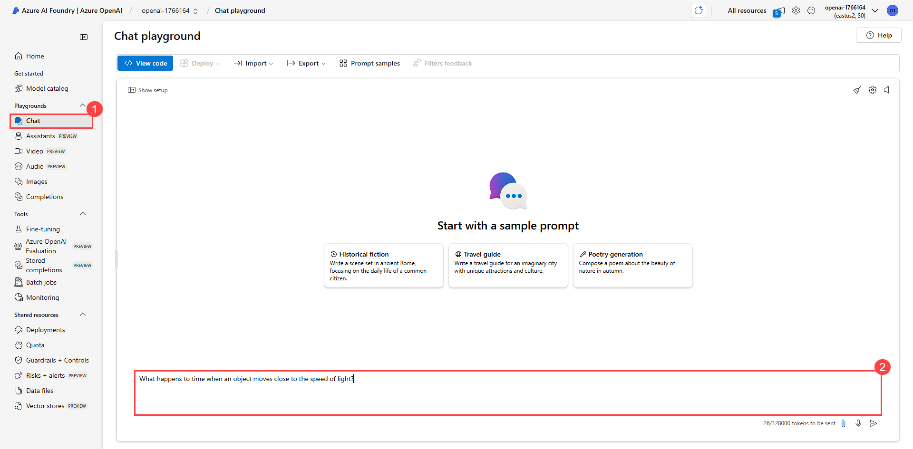

# Exercise 1: Build a Retrieval Augmented Generation solution in Azure AI Foundry 

## Overview

In this exercise, you will learn how to ingest data into a system powered by Azure AI tools and preprocess it using GPT-4o and text embedding models. The exercise involves connecting a Blob Storage to Azure AI Studio, where various data formats (text, images, and tables) have been uploaded. You will use these files to create vectorized indexes, which will be generated using advanced AI models. After that, you will navigate to Azure AI Search to review the creation and structure of these indexes, ensuring that the data has been successfully ingested and preprocessed.

## Objectives

You will be able to complete the following task:

- Task 1: Overview of RAG and Automation

- Task 2: Configuring and testing the solution

### Task 1: Overview of RAG and Automation

In this task, you will explore the fundamentals of Retrieval-Augmented Generation (RAG) and its role in creating intelligent, context-aware AI solutions. You'll also set up Copilot Studio.

#### Introduction to Retrieval-Augmented Generation (RAG)

Retrieval-Augmented Generation (RAG) is a powerful approach in AI that combines retrieval techniques with generative models to deliver accurate and contextually rich responses. By integrating external knowledge sources, RAG enables the generation of more informed outputs compared to standalone generative models. Key features of RAG include:

- **Enhanced Contextual Understanding:** Incorporating relevant documents, databases, or files during inference.

- **Dynamic Knowledge Updates:** Ensuring outputs stay accurate and up-to-date without retraining models.

- **Scalability:** Seamlessly handling diverse data sources and scaling to enterprise needs.

### Task 2: Configuring and testing the solution

In this task, you will connect Blob Storage as a data source in Azure AI Studio's Chat Playground. The GPT-4 Turbo and text embedding models will process the uploaded files, extract relevant data, and create indexed vectors in Azure AI Search. You will then review the created indexes.

1. From the Azure Portal, scroll down and click on **Resource groups**.

   .png)

1. On the Resource groups page, select **copilot**.

   .png)

1. From the resource list, select **openai-<inject key="DeploymentID" enableCopy="false" />** Azure OpenAI Service.

   .png)

1. On the Azure OpenAI page, click on **Explore Azure AI Foundry portal** to navigate to AI Foundry, where you will be ingesting your data.

   .png)

1. Once you're inside **Azure AI Foundry**, go to the **Shared resources** section and click on **Deployments (1)** to view the deployed models under **Model Deployments (2)**.

   .png)

   > **gpt-4o:** GPT-4o is an advanced multimodal model designed to seamlessly handle both text and image inputs with high accuracy and efficiency. It delivers faster responses, improved reasoning, and enhanced visual understanding capabilities, supporting tasks such as image analysis, caption generation, object detection, and complex multimodal interactions. Its balanced performance and versatility make it ideal for a wide range of real-world applications.

   > **text-embedding-ada-002:** A text embedding model converts text into a numerical representation (vector), capturing the semantic meaning of the content. These embeddings allow for efficient similarity searches and can be used to compare, cluster, or retrieve relevant information from large text datasets.

1. In **Azure AI Foundry**, navigate to the chat playgrounds by selecting the **Chat** option from the left-hand menu.

   .png)

1. On chat playground pane, select **Add your data (1)** to ingest data and click on **+ Add a data source (2)**.

   .png)

1. On the **Add data** page, provide the following details and click on **Next (9)**.  

   - **Select data source:** Select **Azure Blob Storage (preview) (1)** from dropdown.

   - **Subscription:** Select the available subscription **(2)**.

   - **Select Azure Blob Storage resource:** Select **storage<inject key="DeploymentID" enableCopy="false" />** **(3)** storage account from list.

   - **Select storage container:** Select **documents (4)** container.

   - **Select Azure AI Search resource:** Select **aisearch-<inject key="DeploymentID" enableCopy="false" />** **(5)** AI Search from list.

   - **Enter the index name:** Enter **phy-index (6)**

   - **Add vector search to this search resource:** Ensure the option is **Checked (7)**

   - **Select an embedding model:** Select **Azure OpenAI Service - text-embedding-ada-002 (8)** model.

     .png)

1. On the **Data Management page**, select **Hybrid (vector + keyword) (1)** under the Search type section. Then, under Select a size, check the **1024 (default) option (2)**. Once both selections are made, click **Next (3)** to continue.

   

1. On the **Data connection** page, select the **API Key (1)**, click on **Next (2)**.

   .png)

1. Review the configuration, and click on **Save and close**.

   .png)

1. Once the Add data pane is closed, you can see the **Ingestion in progress** status under Add your data. Please wait until it completes.

   .png)

   .png)

1. Once the ingestion is complete, navigate back to the Azure portal. From the list of resources in the resource group, select **aisearch-<inject key="DeploymentID" enableCopy="false" />** AI search.

   .png)

1. On the **Azure AI Search** page, select **Indexes** from the left-hand menu under **Search management**. You should see an index named **phy-index** that has been created.

   .png)

   >**Note:** Please wait until some data populates under **Vector index size**, it may take some time to populate. The data may differ from the value shown in the screenshot.

1. Now the data has been ingested, and the index has been created successfully.

1. Now navigate back to **Chat Playground (1)** in Azure AI Foundry Portal, try out these prompts in the **Chat panel (2)** to verify the working of Retrieval Augmented Generation (RAG).

   - `What happens to time when an object moves close to the speed of light?`

   - `Can a cat be alive and dead at the same time?`

   - `What is the fourth dimension, and how is it related to time?`

   - `Why does the sound of a siren change as it passes you?`

   - `Can you explain the physics behind tsunamis?`

   - `What happens to time if you fall into a black hole?`

       

> **Congratulations** on completing the task! Now, it's time to validate it. Here are the steps:
> - Hit the Validate button for the corresponding task. If you receive a success message, it means the exercise has been completed successfully.
> - If not, carefully read the error message and retry the step, following the instructions in the lab guide.
> - If you need any assistance, please contact us at cloudlabs-support@spektrasystems.com. We are available 24/7 to help.

<validation step="7a529e69-2cbc-4b21-b367-7d03fe5eabb1" />

## Summary

In this exercise, you used **Azure AI Studio** to connect a Blob Storage container as a data source within the Chat Playground. Leveraging **GPT-4 Turbo** along with **text embedding models**, you analyzed various content types, including images, text, and tables, to generate **vectorized indexes**. These indexes were subsequently stored in **Azure AI Search**, where you reviewed them to ensure the data was correctly ingested and indexed.

### You have successfully completed the lab!
