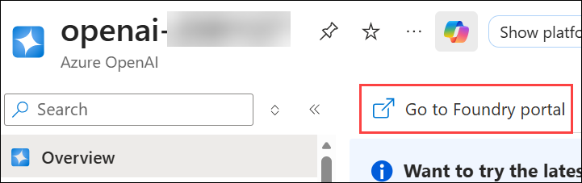
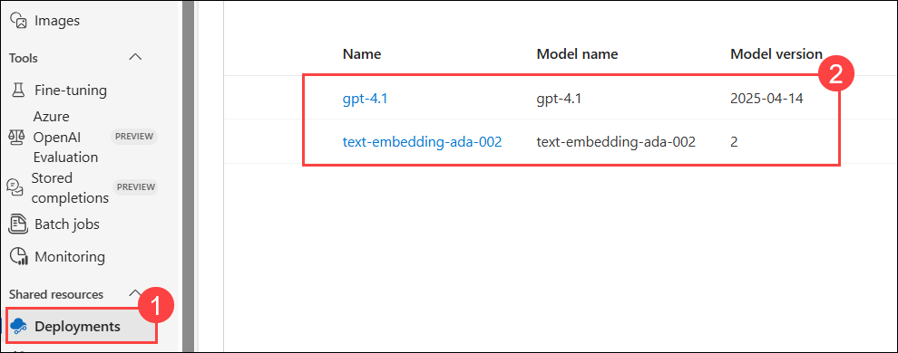
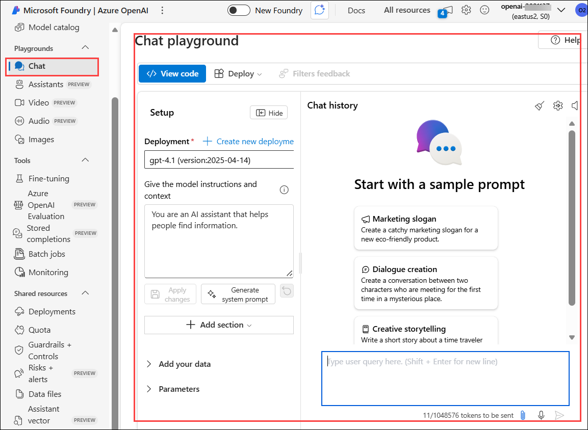
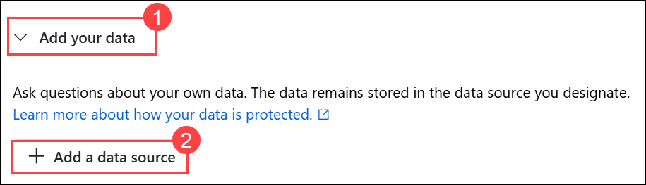
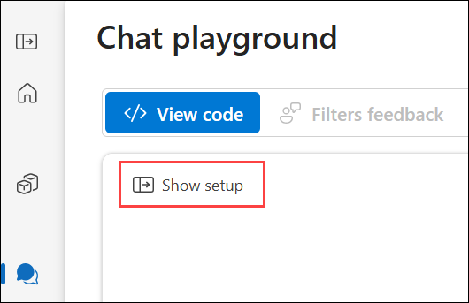
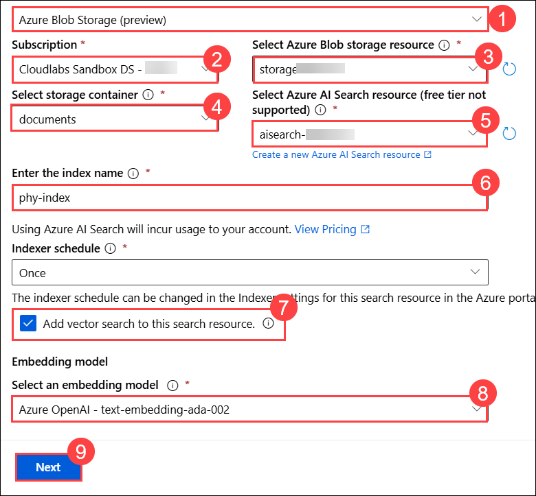
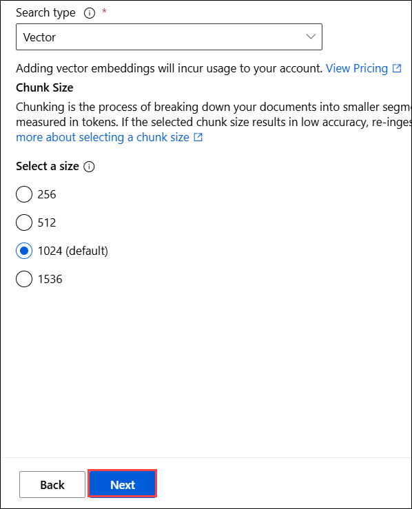
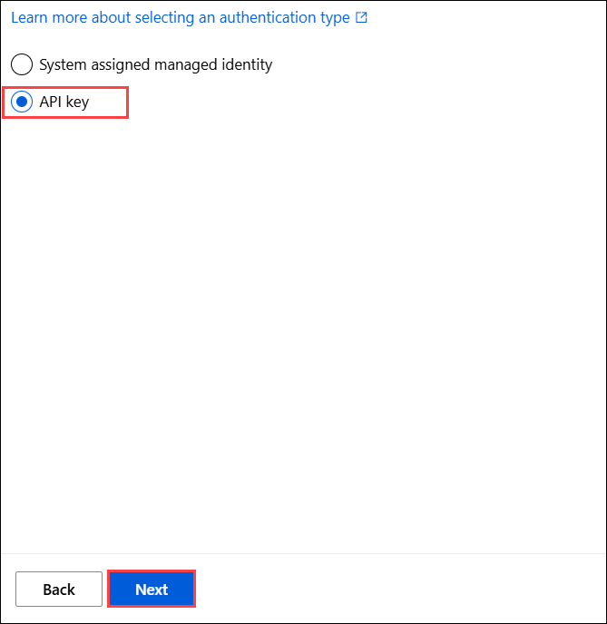
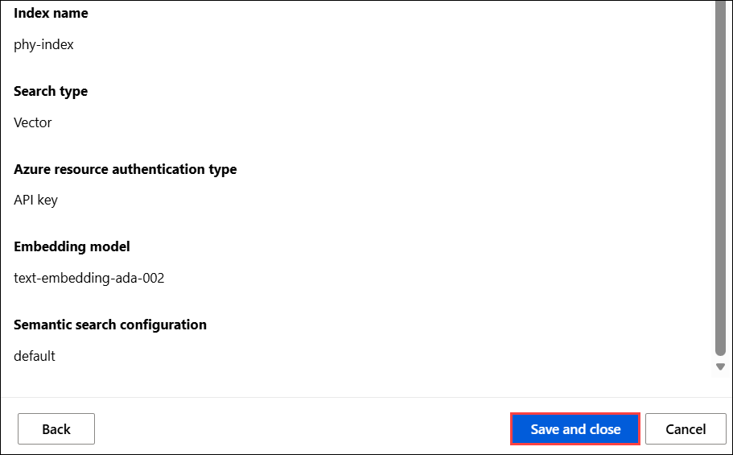
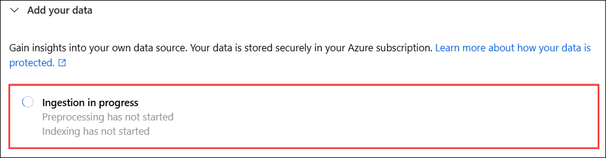

# Exercise 2: Data Ingestion and Preprocessing 

### Estimated Duration: 60 Minutes

## Overview

In this exercise, you will learn how to ingest data into a system powered by Azure AI tools and preprocess it using GPT-4.1 and text embedding models. This exercise involves connecting Azure Blob Storage to Microsoft Foundry, where various datasets have been uploaded. You will use these files to create vectorized indexes, which will be generated using advanced AI models. You will then navigate to Azure AI Search to review the structure of the created indexes, ensuring that the data has been successfully ingested and preprocessed.

## Objectives

You will complete the following task:

- Task 1: Adding and Configuring a Data Source

### Task 1: Adding and Configuring a Data Source

In this task, you will connect Azure Blob Storage as a data source in Microsoft Foundry’s Chat Playground. GPT-4.1 and text embedding model will process the uploaded files, extract relevant data, and create indexed vectors in Azure AI Search. You will then review the created indexes.

1. Now that you have set up Copilot Studio, you will ingest data. Navigate to Azure Portal from your browser.

1. In the Azure portal, scroll down and select **Resource groups** from the Navigate menu.

   

1. In the Resource groups pane, select resource group with the name: **copilot**.

   

1. From the resource list, select **openai-<inject key="DeploymentID" enableCopy="false" />** AI Service.

   

1. In the Azure OpenAI pane, click on **Go to Foundry Portal** to navigate to Microsoft Foundry, where you will be ingesting your data.

   

1. Once you are inside the **Microsoft Foundry**, click on **deployments** to check the deployed models.

   

   > **text-embedding-ada-002:** A text embedding model converts text into a numerical representation (vector), capturing the semantic meaning of the content. These embeddings allow for efficient similarity searches and can be used to compare, cluster, or retrieve relevant information from large text datasets.

1. In Microsoft Foundry, navigate to chat playground by selecting **chat** option from the left menu.

   

1. On chat playground pane, select **Add your data (1)** to ingest data and click on **+ Add a data source (2)**.

   

   >If you are not able to see the setup menu, please click on **show setup** button to expand the setup menu.

      

1. In the **Add data** page, provide the following details and click on **Next (9)**.  

   - **Select data source :** select **Azure Blob Storage (preview) (1)** from dropdown.

   - **Subscription :** Select the available subscription **(2)**.

   - **Select Azure Blob Storage resource :** Select **storage<inject key="DeploymentID" enableCopy="false" />** **(3)** storage account from list.

   - **Select storage container :** select **documents (4)** container.

   - **Select Azure AI Search resource :** select **aisearch-<inject key="DeploymentID" enableCopy="false" />** **(5)** AI Search from list.

   - **Enter the index name :** provide as **phy-index (6)**.

   - **Add vector search to this search resource :** ensure the option is **Checked (7)**

   - **Select an embedding model :** select **Azure OpenAI-text-embedding-ada-002 (8)** model.

     

1. On the Data management pane, keep everything as default and click on **Next**.

   

1. In the **Data connection** page, check the **API Key (1)**, click on **Next (2)** and click on **save and close**.

   

   

1. Once the Add data pane is closed, you will see **Ingestion in progress** status under Add you data. Please wait until it completes.

   

1. Once the ingestion is completed, navigate back to Azure portal and from the resource list of the resource group, select **aisearch-<inject key="DeploymentID" enableCopy="false" />** AI search.

   

1. In the **Azure AI Search** page, select **Indexes** from left menu under Search management, you will be able to see an index with the name **phy-index** has been created.

   

   >**Note:** Please wait until some data populates under **Vector index size**, it may take some time to populate. The data may differ from the value shown in screenshot.

1. Now the data has been ingested, and the index has been created successfully.

<validation step="cc95dc23-c095-45c8-897b-0a9a51d73695" />

> **Congratulations** on completing the task! Now, it's time to validate it. Here are the steps:
> - Hit the Validate button for the corresponding task. If you receive a success message, you can proceed to the next task. 
> - If not, carefully read the error message and retry the step, following the instructions in the lab guide.
> - If you need any assistance, please contact us at cloudlabs-support@spektrasystems.com. We are available 24/7 to help.

## Summary

In this exercise, you navigated to Microsoft Foundry and added a data source by connecting Azure Blob Storage to the Chat Playground. You used GPT-4 Turbo and text embedding models to process text, images, and tables, generating vector indexes. These indexes were created in Azure AI Search, where you reviewed them to confirm successful ingestion and indexing.

