# Exercise 2: Data Ingestion and Preprocessing 

### Estimated Duration: 60 Minutes

## Overview

In this exercise, you will learn how to ingest data into a system powered by Azure AI tools and preprocess it using GPT-5.4 and text embedding models. This exercise involves connecting Azure Blob Storage to Microsoft Foundry, where various datasets have been uploaded. You will use these files to create vectorized indexes, which will be generated using advanced AI models. You will then navigate to Azure AI Search to review the structure of the created indexes, ensuring that the data has been successfully ingested and preprocessed.

## Objectives

You will complete the following task:

- Task 1: Adding and Configuring a Data Source

### Task 1: Adding and Configuring a Data Source

In this task, you will connect Azure Blob Storage as a data source in Microsoft Foundry’s Chat Playground. GPT-5.4 and text embedding model will process the uploaded files, extract relevant data, and create indexed vectors in Azure AI Search. You will then review the created indexes.

1. Now that you have set up Copilot Studio, you will ingest data. Navigate to Azure Portal from your browser.

1. In the Azure portal, scroll down and select **Resource groups** from the Navigate menu.

   

1. In the Resource groups pane, select resource group with the name: **copilot**.

   

1. From the resource list, select **openai-<inject key="DeploymentID" enableCopy="false" />** OpenAI Service.

   

1. On the **openai-<inject key="DeploymentID" enableCopy="false" />** page, from the left navigation menu, select **Identity** under **Resource Management**. On the **Identity** page, select **On (3)** under **System assigned (2)**, and select **Save (4)**.

   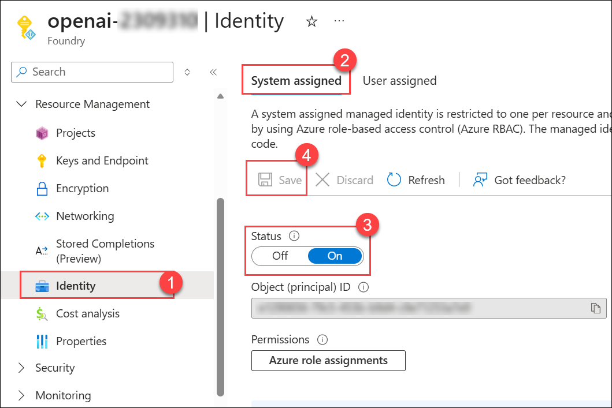

1. Navigate back to the **Overview** section. You will see a blue banner that says, "**Want to try the latest industry models and agents?**" Select **Get Started**.

   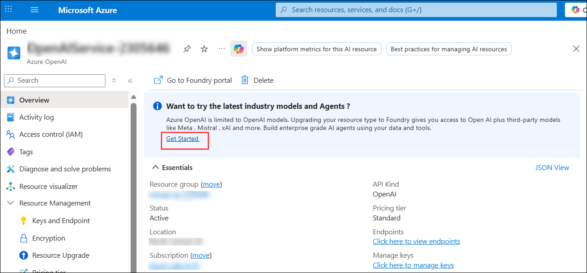

1. OIn the **Resource update** section, do not change any values. Select Next, and then click Create to create the project.

1. In the Azure OpenAI pane, on the **Overview** section, click on **Go to Foundry Portal** to navigate to Microsoft Foundry, where you will be ingesting your data.

   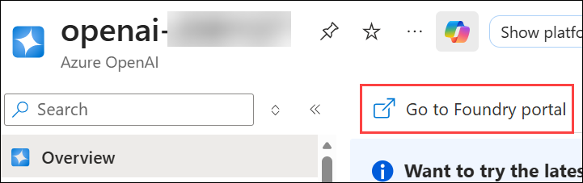

1. Once you are inside the **Microsoft Foundry**, click on **View deployments** to check the deployed models.

   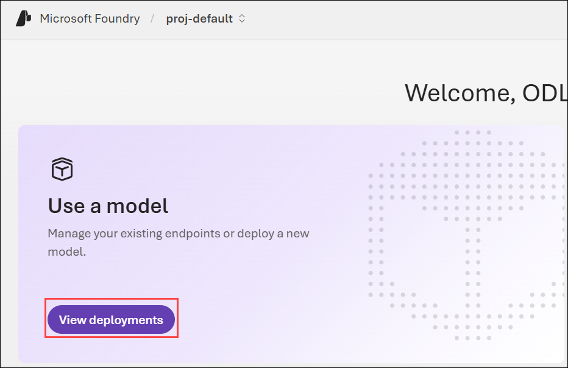

   > **text-embedding-ada-002:** A text embedding model converts text into a numerical representation (vector), capturing the semantic meaning of the content. These embeddings allow for efficient similarity searches and can be used to compare, cluster, or retrieve relevant information from large text datasets.

1. In Microsoft Foundry, select gpt-5.4. On the gpt-5.4 page, select **Save as agent (1)**. In the **Create an agent** pane, enter **OpenAI-<inject key="DeploymentID" enableCopy="false" /> (2)** as the agent name, and then select **Create and open playground (3)**.

   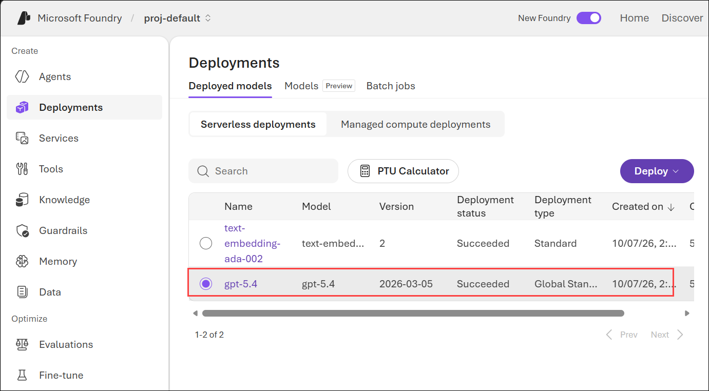

1. In **Microsoft Foundry**, select **Knowledge (1)**. Verify that your Azure AI Search connection is selected **(2)**, and then click **Create a knowledge base (3)**.

    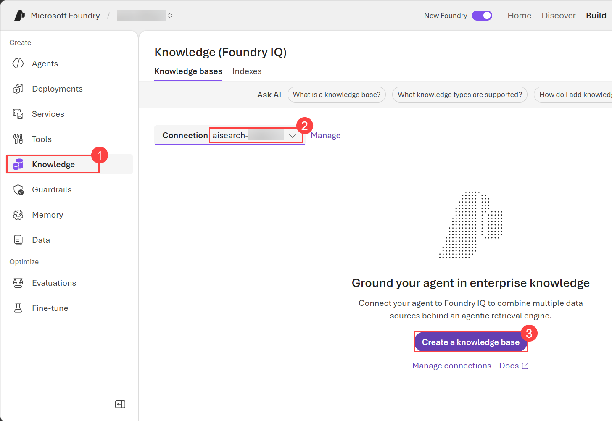

1. On the **Create a new knowledge base** page, configure the following settings. Under **Knowledge sources**, click **Add sources (3)** and select **Azure Blob Storage (4)**.

   | Setting | Value |
   |----------|-------|
   | **Name (1)** | `knowledgebase-<inject key="DeploymentID" enableCopy="false" />` |
   | **Chat completions model (2)** | `gpt-5.4` |

      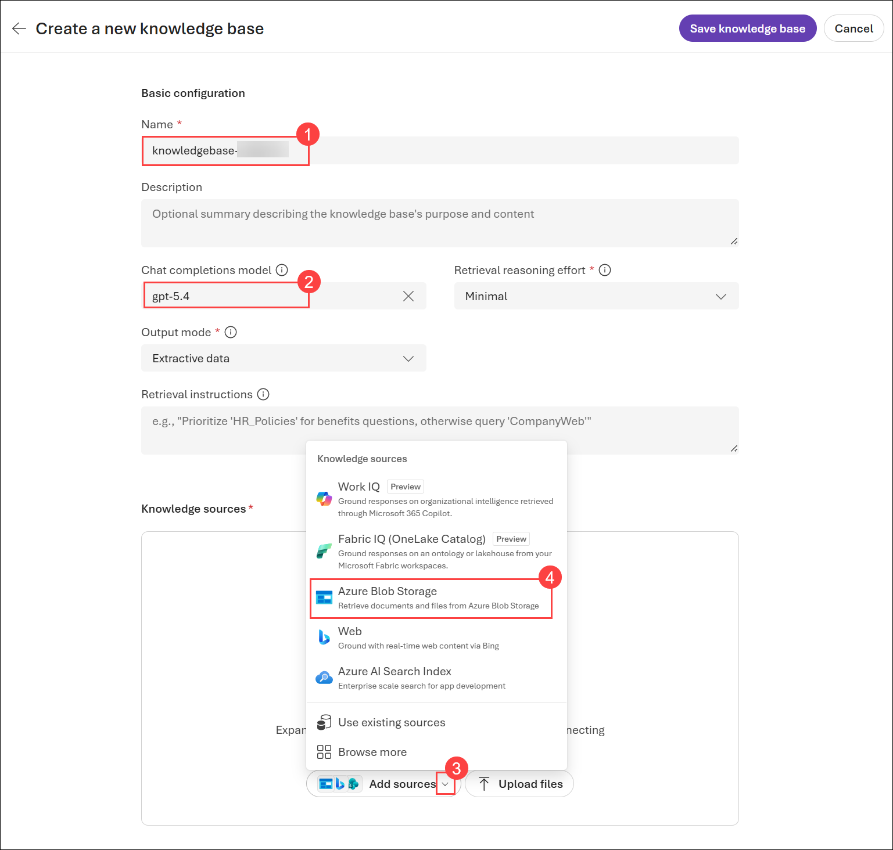

1. On the **Create a knowledge source** page, configure the following settings, and then click **Create (7)**.

    | Setting | Value |
    |----------|-------|
    | **Name (1)** | `phy-index` |
    | **Storage account (2)** | Select your storage account |
    | **Container name (3)** | `documents` |
    | **Authentication type (4)** | **API Key** |
    | **Embedding model (5)** | `text-embedding-ada-002` |
    | **Chat completions model (6)** | `gpt-5.4` |

    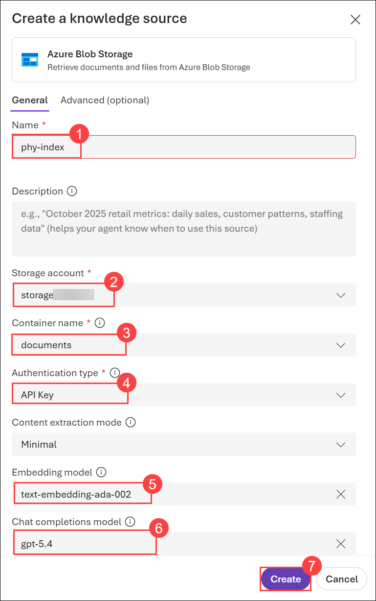

1. After the knowledge source is created, click **Save knowledge base** to save the configuration.

    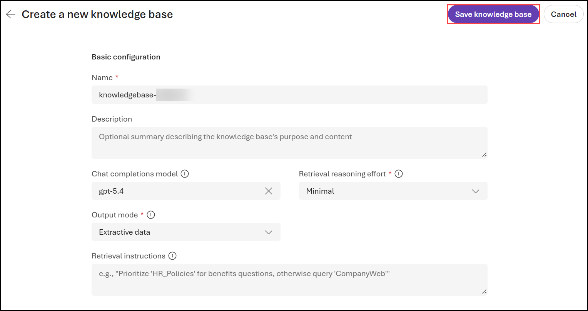

1. Once the ingestion is completed, navigate back to the **Azure portal** and from the resource list of the resource group, select **aisearch-<inject key="DeploymentID" enableCopy="false" />** Search service.

   

1. In the **Azure AI Search** page, under **Search management**, select **Indexes (1)**. Verify that the **phy-index (2)** index has been created.

   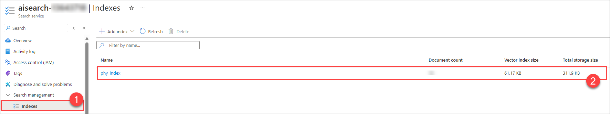

   > **Note:** Please wait until some data populates under **Vector index size**, as it may take a few minutes to complete. The value displayed in your environment may differ from the value shown in the screenshot.

1. Now the data has been ingested, and the index has been created successfully.

<validation step="cc95dc23-c095-45c8-897b-0a9a51d73695" />

> **Congratulations** on completing the task! Now, it's time to validate it. Here are the steps:
> - Hit the Validate button for the corresponding task. If you receive a success message, you can proceed to the next task. 
> - If not, carefully read the error message and retry the step, following the instructions in the lab guide.
> - If you need any assistance, please contact us at cloudlabs-support@spektrasystems.com. We are available 24/7 to help.

## Summary

In this exercise, you navigated to Microsoft Foundry and added a data source by connecting Azure Blob Storage to the Chat Playground. You used GPT-4 Turbo and text embedding models to process text, images, and tables, generating vector indexes. These indexes were created in Azure AI Search, where you reviewed them to confirm successful ingestion and indexing.

## You have successfully completed the lab. Now, click on **Next >>** from the lower right corner to proceed on to the next lab.

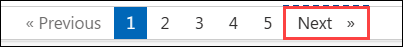