# Exercise 3: Integrating AI Search with Copilot Studio 

### Estimated Duration: 90 Minutes

## Exercise Overview

In this exercise, you will integrate AI Search with Copilot Studio to enhance your AI-powered workflows. You will create an agent, improve query processing with custom topics, and test and optimize the Retrieval-Augmented Generation (RAG) pipeline. This hands-on experience will help you use AI Search to better manage and retrieve information from various data sources, making your applications smarter and more efficient.

## Exercise Objectives

In this exercise, you will complete the following tasks:

- Task 1: Creating and Configuring an AI Agent

- Task 2: Enhancing Query Processing with Custom Topics 

- Task 3: Testing and Optimizing the RAG Pipeline

### Task 1: Creating and Configuring an AI Agent

In this task, you will create an agent in Copilot Studio. The agent will leverage AI capabilities to process queries and generate responses. 

1. Navigate back to the **Copilot Studio** tab. Since you are already logged in, select Agents from the left menu, and then select **+ Create blank agent**.

   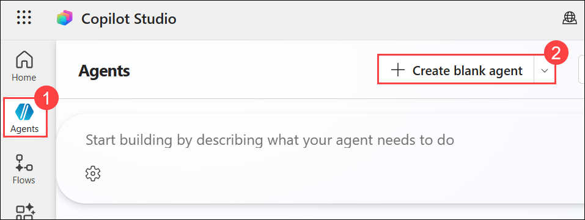

1. In the next pane, wait a few minutes until agent provisioning fully completes. Once the Edit button is enabled, select **Edit** to configure the agent details.

   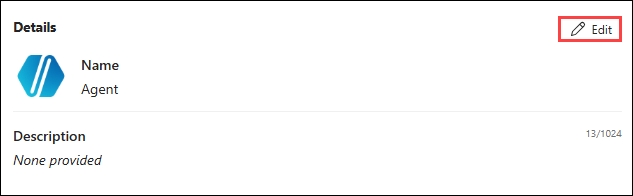

1. In the Edit pane, add the **Name** as `Physics Agent` and click on **Save**.

   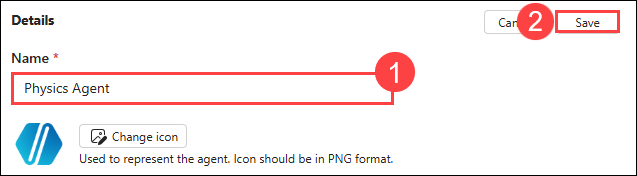

### Task 2: Enhancing Query Processing with Custom Topics 

In this task, you will create custom topics and integrate them with AI Search as a knowledge base. This integration will enhance query processing by providing more relevant, domain-specific responses based on the custom topics you've defined, improving the overall accuracy and utility of the agent’s responses.

1. Before configuring the agent, navigate back to Azure Portal and from the resource list of your resource group, select **aisearch-<inject key="DeploymentID" enableCopy="false" />** AI Search.

   

1. From the overview page, copy the **URL** value and note it safely in a notepad, you will be using this further.

   

1. Select **Keys (1)** from left menu under Settings, copy **Primary admin key (2)** using the option as shown. You will be using this value further in this task.

   

1. Navigate back to Copilot Studio, as you have created an agent, it is now time to add custom topics to the agent. In the **Agents** pane, under **Topics** tab, select **+ Add a topic (1)** and click on **From blank (2)** from the dropdown.

   

   >**LabTip: Topic:** is a structured category of knowledge that helps organize and manage content. It allows the AI to retrieve relevant information from a specific domain.

1. Now you will be navigated to design pane, where you can design the workflow of your topic.

1. In the **Trigger** node, for the description add the below content.

   ```
   This topic retrieves physics concepts from the configured knowledge source and provides a properly grounded response to the user’s query.
   ```

   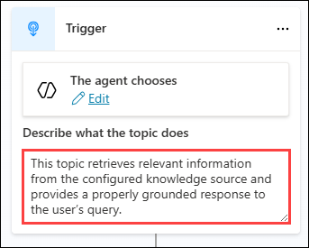

1. Click on **+** to add a new node, from the list select **Ask a question** node.

   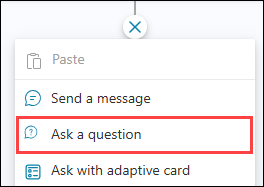

1. In the **Question** node add the below question and click on **>** under Identify.

   ```
   Hello! I am here to assist you with physics concepts. Please let me know which concepts you would like to know?
   ```

   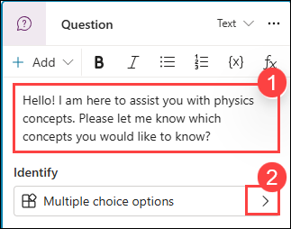

1. Click on the **>** expand options again. From the options, select **User's entire response** to save the user complete question as input.

   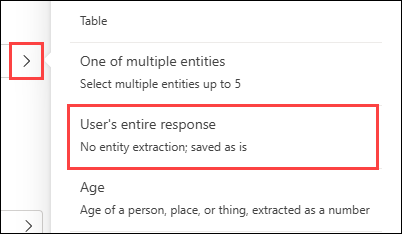

1. Now its time to add a **Generative answers** node. To do that click on **+** in the design pane.

1. Now select **Advanced (1)** from the menu and click on **Generative answers (2)**.

   

1. In the **Create generative answers** node, click on the **...** to select the variable, and select the available variable from the list.

   

1. The **Create generative answers** component has now been added. Select **Edit** under Data sources to configure the knowledge base.

   

1. Now a new pane will be opened from the left, click on **+ Add knowledge** under Knowledge sources.

   

1. Now in the **Add knowledge** page, select **Featured (1)** tab and click on **Azure AI Search (2)** as you are integrating Azure AI Search resource.
  
   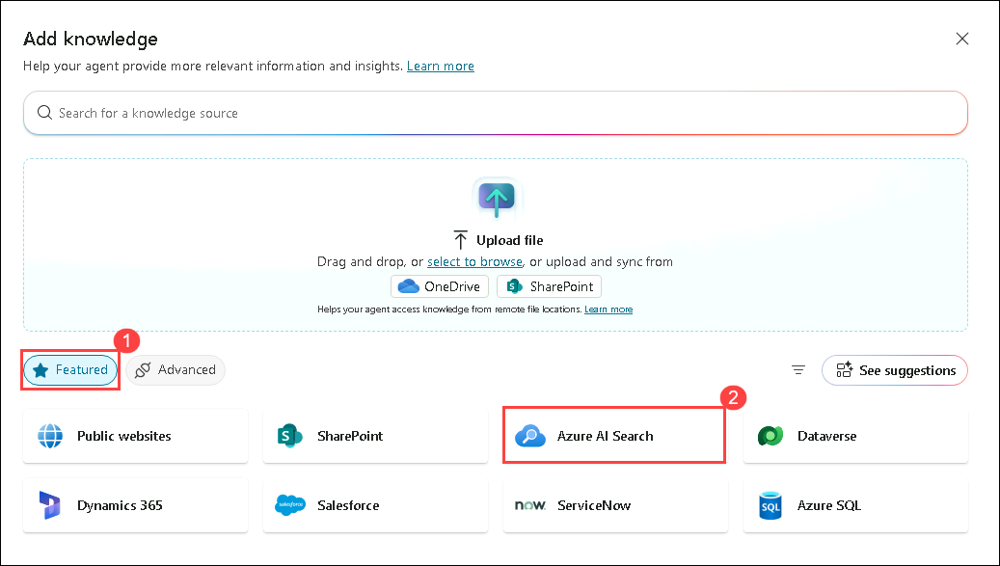

1. In the Azure AI Search page, click on **drop down** option and select **Create new connection**.

   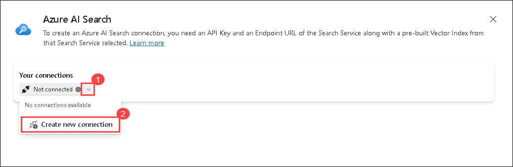

1. Now provide **Azure AI Search Endpoint URL (1)** and **Azure AI Search Admin Key (2)** values which you have copied earlier and click on **Create (3)**.

   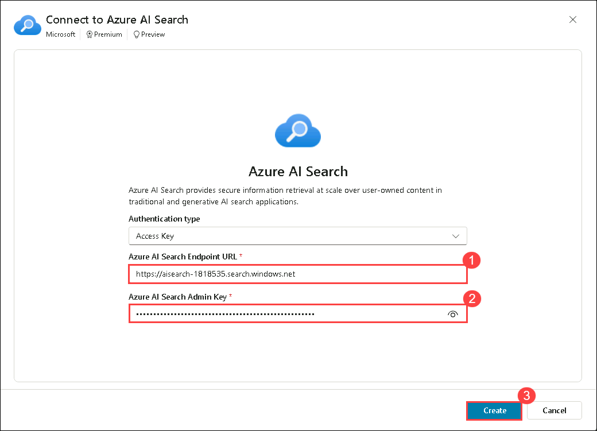

1. In the following pane, ensure that **phy-index** is selected, then click **Add to agent**.

   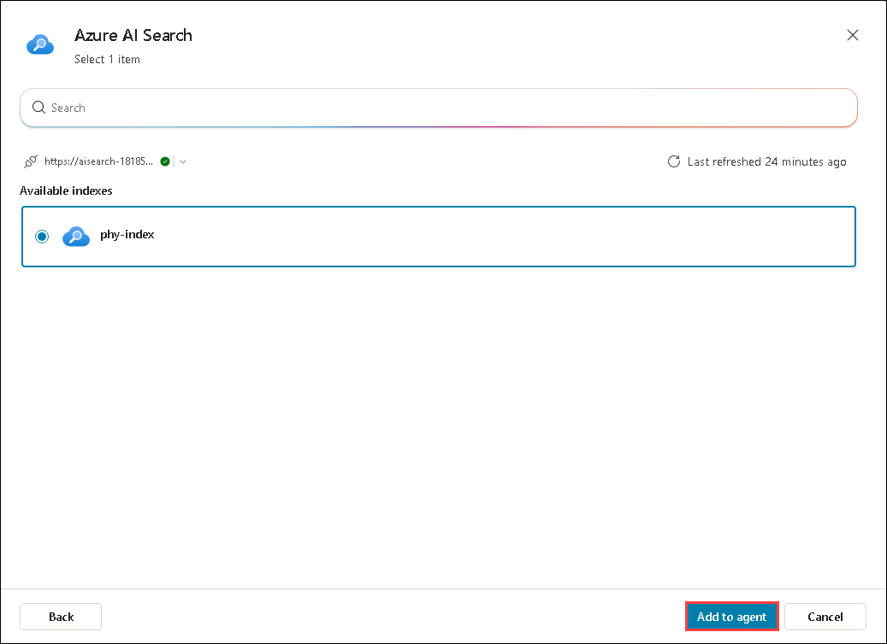

1. The **Create generative answers** component has now been added. Select **Edit** under Data sources to configure the knowledge base.

   

1. In the same pane, under Knowledge sources, toggle **Search only selected sources (1)** button and select **AI Search (2)** Knowledge base. Make sure that **Allow the AI to use its own general knowledge (preview) (3)** option is turned off.

   


1. Once after setup, your workflow will look similar to this.

   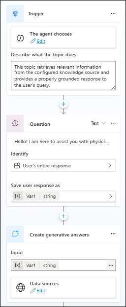

1. Once after adding the input, click on **Save** and provide the name as **phy-topic** and save it.

   

   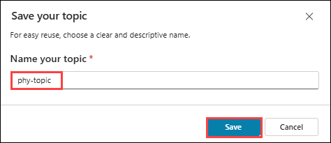

1. You have now successfully created an agent using your own data. You will test and verify the working of the agent in further task.

### Task 3: Testing and Optimizing the RAG Pipeline

In this task, you will test the RAG pipeline in Copilot Studio. You will evaluate the effectiveness of the integration between AI Search and the agent, test its ability to handle queries, and optimize the pipeline to ensure fast, accurate, and context-aware responses.

1. In the design pane, you will see the Test your agent chat area on the right.
  
   >**Note** : If you do not see the **Test your agent** option, click on **Test** in the top-right corner.

1. In the **Test your agent** pane, use `hello, physics bot, i want to explore physics concepts` to trigger your topic, the agent will respond with a message similar to: **Hello! I am here to assist you with physics concepts. Please let me know which concepts you would like to know?**, then use the prompts given to explore your agent.

   

1. A collection of physics concepts has been added to the knowledge base for testing purposes. Use the following sample prompts to test the agent:

   - `What happens to time when an object moves close to the speed of light?`

   - `Can a cat really be alive and dead at the same time?`

   - `What is the fourth dimension, and how is it related to time?`

   - `Why does the sound of a siren change as it passes you?`

   - `Can you explain the physics behind tsunamis?`

   - `What happens to time if you fall into a black hole?`

## Summary

In this exercise, you integrated AI Search with Copilot Studio to enhance your AI-powered workflows. You created an agent, improved query processing with custom topics, and tested and optimized the Retrieval-Augmented Generation (RAG) pipeline. This hands-on experience helped you use AI Search to better manage and retrieve information from various data sources, making your applications smarter and more efficient.
