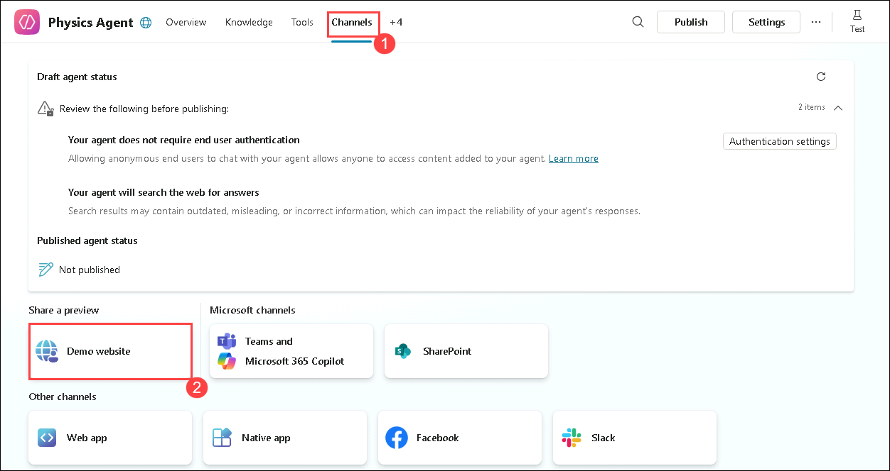

# Exercise 4: Deployment and Publishing Options 

### Estimated Duration: 60 Minutes

## Exercise Overview

In this exercise, you will explore various deployment and publishing options for your AI-powered solution. The focus will be on integrating Retrieval-Augmented Generation (RAG) with custom platforms, with an emphasis on deploying the solution to a public demo website. Authentication will be removed in this exercise because the application will be deployed as a public website. You will explore available publishing channels, such as Teams, Slack, and others, but in this exercise, you will configure and publish the app specifically to the Demo Website channel.

## Exerccise Objectives

- Task 1: Integrating RAG with custom platform

### Task 1: Integrating RAG with Custom Platforms

In this task, you will integrate your RAG solution with a demo website, using it as the deployment platform. Since the website will be public, authentication will be removed. You will explore the available channels, such as Teams and Slack, but for this exercise, the focus will be on configuring the Demo Website channel and publishing the app.

1. As you have configured and tested your bot, now that you have configured and tested your agent, it is time to publish it as a demo website.

1. In the Copilot Studio agent page, from the top bar, select **Settings**. 

   

   >**Note** : If you do not see the **Settings** option, click on the **ellipsis (...)** and select **Settings**.

1. From the **Settings** pane, select **Security (1)** from left menu and click on **Authentication (2)**.

   

1. Under **Authentication**, choose **No authentication (1)** option, as you are publishing the agent as a website. Click on **Save (2)**. **Close** settings from top right of the settings menu.

   

   

1. Once the authentication part is done, navigate to **Channels (1)** tab and check that many options are available to publish the agent, but in this lab you will be using **Demo webiste (2)** option, so click on that.

   

   >Other Options:

    - **Teams:** Publishing your AI-powered agent in Microsoft Teams enables seamless integration with one of the most widely used collaboration platforms in businesses. By deploying the agent within Teams, employees or teams can interact with it directly within their workflows. This is useful for support bots, HR assistants, project management tools, and task automation scenarios., or task automation, where the agent can assist in real-time communication, meetings, or project channels. Teams bots can also use advanced features like adaptive cards and proactive messaging to keep users informed and engaged.

    - **Slack:** Slack is another popular team collaboration tool. By publishing your agent to Slack, you enable your team to integrate the AI agent directly into channels, direct messages, or workflows. Slack bots can automate tasks like setting reminders, providing data reports, answering FAQs, or assisting with specific workflows such as onboarding.

    - You can explore more on these publishing options using this [Reference](https://learn.microsoft.com/en-us/microsoft-copilot-studio/publication-fundamentals-publish-channels?tabs=web)

1. Once the **Demo Website** option is selected, a new pane will be opened from left. In that pane, providea friendly welcome message and a few conversation starters as follows:

   - **Welcome message:** `Hi there! I'm your friendly Physics Bot 🤖. I'm here to help you understand everything from how black holes work to mind-bending formulas. Let's explore the wonders of the universe together!` **(1)** 

   - **Conversation starters: (2)** 
      - `What happens to time if you fall into a black hole?`
      - `What is Friction?`
      - `Define Mass of Earth`

   -  Use the **Copy (3)** button to copy the URL of the website, note it down safely and click on **Save (4)**.

      

1. Once the configuration is saved, close the settings pane and select **Publish** from the top menu.

   

1. On **Publish this agent** pane, click on **Publish**.

   

1. Once it is published, open a new tab in the browser and use the URL copied to navigate to the **Demo Website**. A user interface will open, allowing you to interact with your published agent.

   

   

<validation step="64e70b89-f882-4aa0-a5c4-056506a10a70" />

> **Congratulations** on completing the task! Now, it's time to validate it. Here are the steps:
> - Hit the Validate button for the corresponding task. If you receive a success message, you can proceed to the next task. 
> - If not, carefully read the error message and retry the step, following the instructions in the lab guide.
> - If you need any assistance, please contact us at cloudlabs-support@spektrasystems.com. We are available 24/7 to help

## Summary

In this exercise, you explored various deployment and publishing options for your AI-powered solution. The focus was on integrating Retrieval-Augmented Generation (RAG) with custom platforms, with an emphasis on deploying the solution to a public demo website. Authentication was removed in this exercise because the application was deployed as a public website. You examined different available channels, such as Teams, Slack, and others, but the primary focus was on configuring and publishing the app specifically to the Demo Website channel.

## Overall Lab Summary

In this lab, you built a Retrieval-Augmented Generation (RAG) solution using Copilot Studio and Azure AI services. You ingested and indexed data using Azure Blob Storage and Azure AI Search, integrated the search capability into a custom agent, and enhanced query processing with custom topics.

Finally, you deployed and published your solution to a public demo website. By completing this lab, you gained hands-on experience in building, integrating, and publishing a RAG-powered AI solution.

### You have successfully completed the Lab!