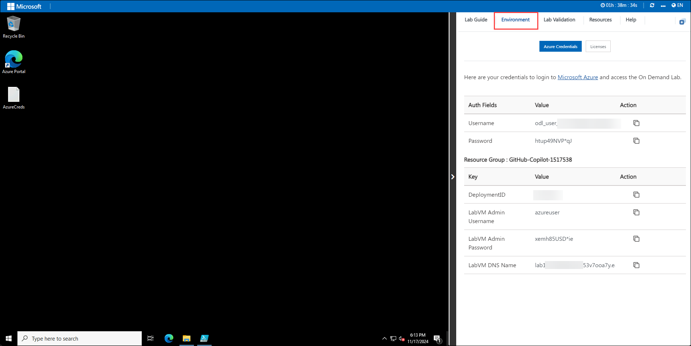
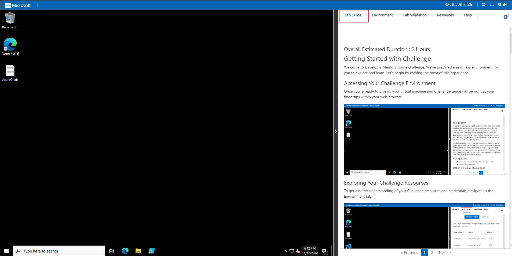

# Building a Multimodal RAG Solution with Copilot Studio

### Overall Estimated Duration : 4 Hours

## Overview

This hands-on lab guides participants through building and automating a Retrieval-Augmented Generation (RAG) solution using Copilot Studio. Participants will explore how to ingest diverse data sources while leveraging AI models like text embeddings, language models, and generative AI capabilities. The lab will cover customizing topics, automating workflows. Additionally, participants will learn to publish the solution to custom channels as websites. 

## Objective

Learn to build and automate a Retrieval-Augmented Generation (RAG) solution using Copilot Studio, leveraging AI models like text embeddings, language models, and generative AI. By the end of this lab, you will get insights on these concepts:

- **Introduction to Retrieval-Augmented Generation (RAG) Automation and Copilot Studio :** Understanding foundational concepts and practical applications of Retrieval-Augmented Generation (RAG).

- **Data Ingestion and Preprocessing :** Learn to ingest data into a system powered by Azure AI tools and preprocess it using GPT-4 Turbo and text embedding models.

- **Integrating AI Search with Copilot Studio :** Understand how to integrate AI Search with Copilot Studio to enhance your AI-powered workflows.

- **Deployment and Publishing Options :** Learn integrating Retrieval-Augmented Generation (RAG) with custom platforms, with an emphasis on deploying the solution to a public demo website.

## Pre-requisites

Participants should have the following prerequisites:

- **Familiarity with Azure Resources:** Basic understanding of Azure services and the Azure portal for managing cloud resources.

- **Knowledge of Copilot Studio:** Familiarity with Copilot Studio and its capabilities for building AI-driven solutions.

- **Understanding of RAG Concepts:** Basic knowledge of Retrieval-Augmented Generation (RAG) and its applications in AI workflows.

## Architecture

The architecture facilitates the seamless ingestion and retrieval of data for user interactions in Copilot Studio. Documents are stored in Azure Blob Storage, which serves as the source for data ingestion. AI Studio processes these documents using models from Azure AI Services via the chat playground. The processed data is indexed using AI Search, allowing efficient retrieval. Finally, Copilot Studio enables user interactions, including Q&A, by leveraging the indexed data for intuitive and responsive workflows.

## Architecture Diagram


## Explanation of Components

The architecture for this lab involves several key components:

- **Azure Blob Storage:** Serves as the primary data repository, storing documents that will be ingested into the system. This ensures secure and scalable storage for unprocessed data.

- **AI Studio:** Acts as the ingestion layer where documents from Azure Blob Storage are processed. It leverages Azure AI Services to apply language models for extracting relevant information and preparing it for indexing.

- **Azure AI Services:** Provides the advanced AI models, including language understanding and generative capabilities, used by AI Studio to extract data and process user interactions efficiently.

- **Azure AI Search:** Creates semantic indexes from the processed data, enabling efficient and meaningful retrieval of information. This component supports enhanced search capabilities by understanding user queries contextually.

- **Copilot Studio:** Facilitates user interaction by connecting to Azure AI Search for Q&A and other workflows. It provides an intuitive interface for leveraging indexed data and AI capabilities in real-time.

## Getting Started with Lab

Welcome to Building a Multimodal RAG Solution with Copilot Studio Hands-On-Lab! , We've prepared a seamless environment for you to explore and learn. Let's begin by making the most of this experience.

>**Note:** If a PowerShell window appears once the environment is active, please don't close it. Minimize it instead of closing it and proceed with the tasks.

### Accessing Your Lab Environment

Once you're ready to dive in, your virtual machine and Lab guide will be right at your fingertips within your web browser.



### Exploring Your Lab Resources

To get a better understanding of your Lab resources and credentials, navigate to the Environment tab.



### Utilizing the Split Window Feature

For convenience, you can open the Lab guide in a separate window by selecting the Split Window button from the Top right corner


### Managing Your Virtual Machine

Feel free to start, stop, or restart your virtual machine as needed from the Resources tab. Your experience is in your hands!


## Let's Get Started with Azure Portal

1. In the JumpVM, click on **Microsoft Edge** browser which is created on desktop.

   

1. Open a new browser tab and navigate to the Power Apps portal using the link below:

   ```
   https://make.powerapps.com/
   ```

1. On the **Sign into Microsoft** tab, you will see the login screen. Enter the provided email or username, and click **Next** to proceed.

   - Email/Username: **<inject key="AzureAdUserEmail"></inject>**

     

1. Now, enter the following password and click on **Sign in**.

   - Password: **<inject key="AzureAdUserPassword"></inject>**

     

     > **Note:** If you see the Action Required dialog box, then select **Ask Later** option.
     
1. If you see the pop-up **Stay Signed in?**, click **No**.

   

1. If the **Welcome to Power Apps** pop-up appears, leave the default country/region selection and click **Get started**.

   

1. You have now successfully logged in to the Power Apps portal. Keep the portal open.

   

   > **Note:** We are signing in to the Power Apps portal because it automatically assigns a Developer license, which is required to create and use a Developer environment in the next steps.

1. Open a new browser tab, and then navigate to the Power Platform admin center.

   ```
   https://admin.powerplatform.microsoft.com
   ```

1. In the **Power Platform admin center**, select **Manage** from the left navigation pane.

   

1. In the Power Platform admin center, select **Environments (1)** from the left navigation pane, and then choose **New (2)** to create a new environment.

   

   > **Note:** If the **New** environment page does not load, refresh the browser and try again.

1. In the **New environment** pane, configure the environment with the following settings, and then select **Next (4)**:

   - Enter **ODL_User <inject key="DeploymentID" enableCopy="false"></inject>'s Environment** in the **Name (1)** field.
   - Set **Get new features early (2)** to **Yes**.
   - Select **Developer (3)** from the **Type** dropdown.

      

1. In the **Add Dataverse** pane, leave all settings as default, and then select **Save**.

   

   > **Environment Foundation:** This step creates the foundational environment that will support your agents with company-specific data and knowledge sources.

   > **Note:** Environment provisioning may take 10–15 minutes to complete. Wait until the status shows as ready before proceeding.

   > **Note:** If you see an error stating that the environment list cannot be displayed, this is expected while the environment is being created in the background. After 10–15 minutes, refresh the browser and the environment should appear.

1. In the power **platform admin center**, select **Manage** from left menu and click on the environmnet with the name, ODL_User <inject key="Deployment ID" enableCopy="false"></inject>'s Environment.

   

1. In the environmnet page, click on **See all** under **S2S apps**.

   

1. In the next pane, click on **+ New app user**.

   

1. In the create a new app user pane, under **App**, click on **+ Add an app**.

   

1. From the list of apps, search for `https://cloudlabssandbox.onmicrosoft.com/cloudlabs.ai/` and select it.

   

1. Once done, under **Business unit** search for **org** and select the only business unit that comes in the list.

   

1. Beside **Security roles** click on **Edit** icon.

   

1. From the list of roles, search and select **System Administrator** and click on **Save**.

   

1. In the pop-up window, select **save**.

   

1. Review all the details and click on **Create**.

   

1. Navigate to **Microsoft Copilot Studio** by opening a new browser tab and using the link below:

   ```
   https://copilotstudio.microsoft.com
   ```

1. On the **Welcome to Microsoft Copilot Studio** screen, keep the default **country/region** selection and click **Get Started** to continue.

   

1. If the **Welcome to Copilot Studio!** pop-up appears, click **Skip** to continue to the main dashboard.

   

1. If you are directly taken to the **agent creation** screen, click the **ellipsis (1)** icon beside the **Create** button, then select **Cancel agent creation (2)** to return to the main dashboard.

   

1. In Copilot Studio, open the environment picker **(1)**, expand **Supported environments (2)**, and select **ODL_User <inject key="Deployment ID" enableCopy="false"></inject>'s Environment (3)** to switch.

   

   > If you are not able to see the environment under **Supported environments**, follow the below steps.

   

   1. In the **Power Platform admin center**, select **Environments** from the left navigation pane, and then verify that **ODL_User <inject key="DeploymentID" enableCopy="false"></inject>'s Environment** is listed.

      
   
   1. On the **ODL_User 22<inject key="DeploymentID" enableCopy="false"></inject>'s Environment** details page, copy the **Environment ID**.

      
      
   1. Open a **new browser tab**, and paste the copied **Environment ID** at the end of the following URL to verify access:

      ```
      https://copilotstudio.microsoft.com/environments/(Environment ID)
      ```

      

      > **Note:** Replace **(Environment ID)** with the ID you copied in the previous step.
      
   1. You will be navigated to the **Copilot Studio** portal. Verify that **ODL_User <inject key="Deployment ID" enableCopy="false"></inject>’s Environment** is visible and selected under **Supported environments**.

      

## Support Contact

The CloudLabs support team is available 24/7, 365 days a year, via email and live chat to ensure seamless assistance at any time. We offer dedicated support channels tailored specifically for both learners and instructors, ensuring that all your needs are promptly and efficiently addressed.Learner Support Contacts:

- Email Support: cloudlabs-support@spektrasystems.com
- Live Chat Support: https://cloudlabs.ai/labs-support

Now, click on the **Next** from lower right corner to move on next page.

## Happy Learning!!
