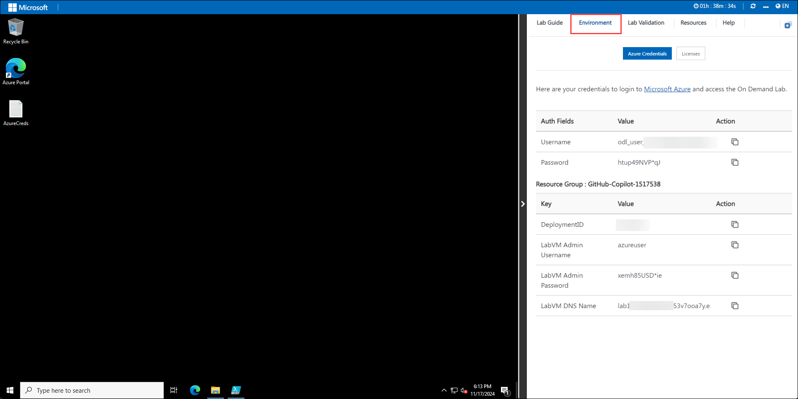
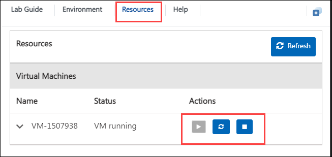
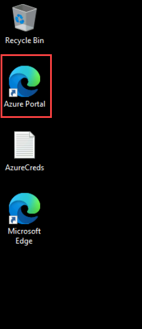
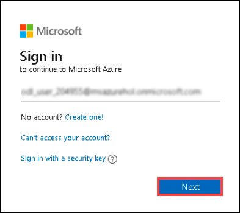
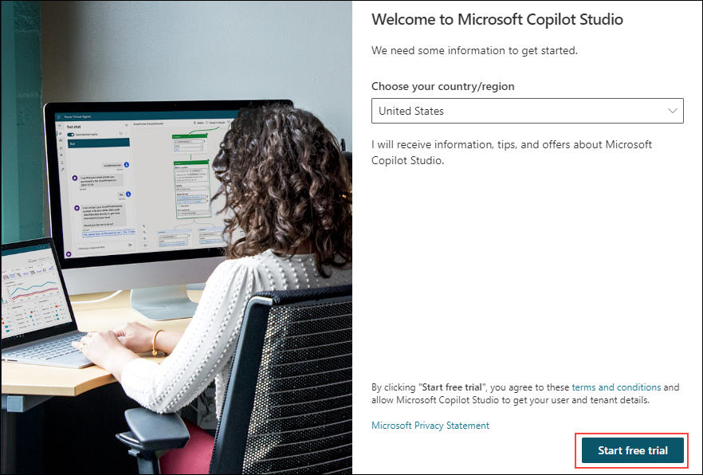
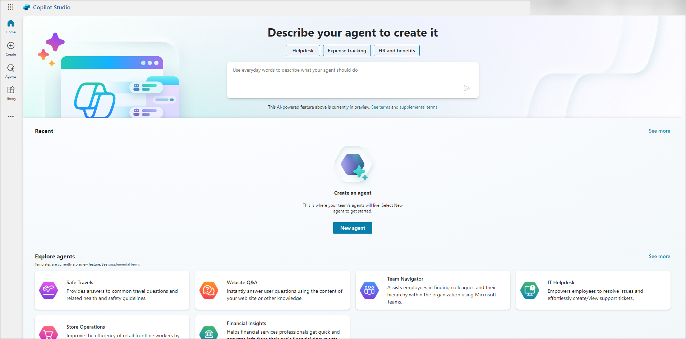
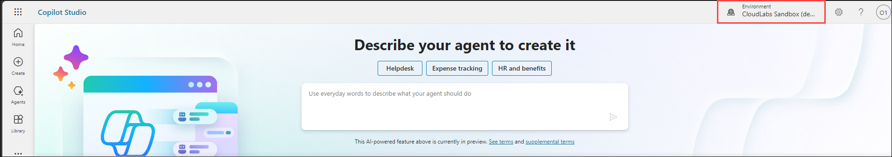
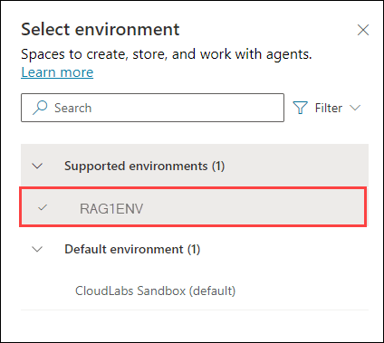

# Getting started with Challenge Environment

### Overall Estimated Duration : 4 Hours

Welcome to Copilot Hackathon, We've prepared a seamless environment for you to explore and learn. Let's begin by making the most of this experience.

### Accessing Your Challenge Environment

Once you're ready to dive in, your virtual machine and Challenge guide will be right at your fingertips within your web browser.

### Exploring Your Challenge Resources

To get a better understanding of your Challenge resources and credentials, navigate to the Environment tab.

### Utilizing the Split Window Feature

For convenience, you can open the Challenge guide in a separate window by selecting the Split Window button from the Top right corner

### Managing Your Virtual Machine

Feel free to start, stop, or restart your virtual machine as needed from the Resources tab. Your experience is in your hands!

## Let's Get Started with Azure Portal

1. In the JumpVM, click on **Azure portal** shortcut of Microsoft Edge browser which is created on desktop.

   

2. On **Sign into Microsoft Azure** tab you will see login screen, in that enter following email/username and then click on **Next**.

   - Email/Username: <inject key="AzureAdUserEmail"></inject>
     
     

3. Now enter the following password and click on **Sign in**.

   - Password: <inject key="AzureAdUserPassword"></inject>

     

     >**Note:** If you see the Action Required dialog box, then select Ask Later option.

     

4. If you see the pop-up **Stay Signed in?**, click No.

5. If you see the pop-up **You have free Azure Advisor recommendations!**, close the window to continue the Challenge.

6. If a **Welcome to Microsoft Azure** popup window appears, click **Cancel** to skip the tour.

## Accessing Copilot Studio

1. Navigate to **Copilot Studio**  in a new tab using this link: [copilot studio](https://go.microsoft.com/fwlink/p/?linkid=2252408&clcid=0x409&culture=en-us&country=us)

1. On Welcome to Microsoft Copilot Studio page, Click on **Start Free Trial**.

   

1. If the **Welcome to Copilot Studio** prompt appears, click **Skip**.
 
1. Once you are inside **Copilot Studio** you will be in the home page. 

   

1. In the home page, select the environment option as shown.

   

1. Change the environment to the new environmnet, where the name will be in the format RAG**X**ENV. Keep the tab open as you will be using this in further exercises.

   

1. Keep this browser tab open, you will be using this further.

1. Now, click on the **Next** from lower right corner to move on next page.

